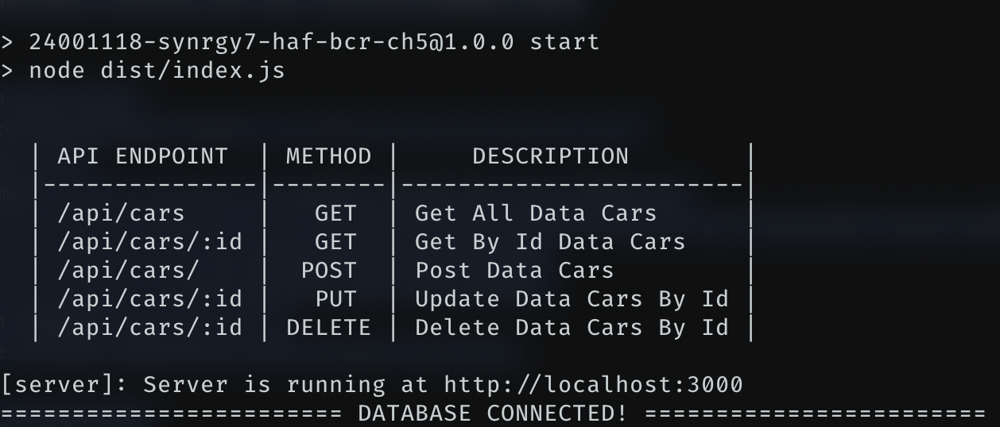

### SYNRGY 7 BINAR CHALLENGE 5 RESTFUL API FSW 2 HAFIIDH LUQMANUL HAKIM

### INSTRUCTION
1. Clone project into your local
2. Change directory to this project folder `cd 24001118-synrgy7-haf-bcr-ch5`
3. Use command `npm install`
4. Next step use command `npm run compile` to compile TypeScript into JavaScript
5. Make sure copy `.env.example` file to `.env` and fill up the correct value of your PostgreSQL connection!
6. Run command `npx knex migration:up` to create table via migration
7. Run command `npx knex seed:up` to fill up table with data seeder!
8. For final step run command `npm run start`
9. Make sure database already connected to your project like this
   


10. Have fun and enjoy! (Becareful it's fragile)

### ENDPOINT LIST

| API ENDPOINT    | METHOD   |     DESCRIPTION        |
|-----------------|----------|------------------------|
| `/api/cars`     |   `GET`  | Get All Data Cars      |
| `/api/cars/:id` |   `GET`  | Get By Id Data Cars    |
| `/api/cars/`    |  `POST`  | Post Data Cars         |
| `/api/cars/:id` |   `PUT`  | Update Data Cars By Id |
| `/api/cars/:id` | `DELETE` | Delete Data Cars By Id |

### EXAMPLE DATA
- **Show All Data Cars**
    - **Request** 
        - Endpoint : `/api/cars`
        - method : `GET`
    - **Get Data Success**
        - cURL Request :
          ```
          curl -i --location 'http://localhost:3000/api/cars'
          ```
        - cURL Response :
          ```
          HTTP/1.1 200 OK
          X-Powered-By: Express
          Content-Type: application/json; charset=utf-8
          Content-Length: 1578
          ETag: W/"62a-gLb8gOcDaSFgSle5SRl90LssCM8"
          Date: Fri, 17 May 2024 12:32:10 GMT
          Connection: keep-alive
          Keep-Alive: timeout=5
        
          {"status":true,"message":"Success Get Cars!","data":{"cars":[{"id":1,"name":"Honda Camry","price":50000000,"picture":"https://res.cloudinary.com/dfylrgzcu/image/upload/v1715849971/fsw/i9w2bvzhkv3n5h7suew3.jpg","start_rent":"2024-05-30T12:14:00.000Z","finish_rent":"2024-06-20T12:14:00.000Z","created_at":"2024-05-16T12:08:57.670Z","updated_at":"2024-05-16T08:59:28.000Z"},{"id":2,"name":"Bugatti Veyron","price":70000000,"picture":"https://res.cloudinary.com/dfylrgzcu/image/upload/v1715850166/fsw/yn7lfl9i4ok7dp8kiogs.jpg","start_rent":"2024-05-30T12:14:00.000Z","finish_rent":"2024-06-20T12:14:00.000Z","created_at":"2024-05-15T15:47:25.000Z","updated_at":"2024-05-16T08:59:28.000Z"},{"id":3,"name":"Ferrari 458 Italy","price":5774000,"picture":"https://res.cloudinary.com/dfylrgzcu/image/upload/v1715850490/fsw/lha70u5wfv8aqyab7xr0.jpg","start_rent":"2024-05-30T12:14:00.000Z","finish_rent":"2024-06-20T12:14:00.000Z","created_at":"2024-05-15T15:47:25.000Z","updated_at":"2024-05-16T08:59:28.000Z"},{"id":4,"name":"ERD Cars","price":5000000,"picture":"https://res.cloudinary.com/dfylrgzcu/image/upload/v1715865421/fsw/wjn2pe9juugluusnemzc.png","start_rent":"2024-05-14T20:14:00.000Z","finish_rent":"2024-05-20T20:14:00.000Z","created_at":"2024-05-16T13:16:58.125Z","updated_at":null},{"id":5,"name":"\"ERD Cars\"","price":5000000,"picture":"https://res.cloudinary.com/dfylrgzcu/image/upload/v1715948828/fsw/vp1ctpz8mm5n3q2povmz.png","start_rent":"2024-05-14T20:14:00.000Z","finish_rent":"2024-05-20T20:14:00.000Z","created_at":"2024-05-17T12:27:04.784Z","updated_at":null}]}}
          ```

- **Show Data Cars By Id**
    - **Request** 
        - Endpoint : `/api/cars/:id`
        - Parameter: `:id`
        - method : `GET`
    - **Get Data Success**
        - cURL Request :
          ```
          curl -i --location 'http://localhost:3000/api/cars/1'
          ```
        - cURL Response :
          ```
          HTTP/1.1 200 OK
          X-Powered-By: Express
          Content-Type: application/json; charset=utf-8
          Content-Length: 376
          ETag: W/"178-b6opYxiDk80e5+AAGPg4qX9nJLA"
          Date: Fri, 17 May 2024 12:36:11 GMT
          Connection: keep-alive
          Keep-Alive: timeout=5
            
            {"status":true,"message":"Success Get Car By Id!","data":{"car":{"id":1,"name":"Honda Camry","price":50000000,"picture":"https://res.cloudinary.com/dfylrgzcu/image/upload/v1715849971/fsw/i9w2bvzhkv3n5h7suew3.jpg","start_rent":"2024-05-30T12:14:00.000Z","finish_rent":"2024-06-20T12:14:00.000Z","created_at":"2024-05-16T12:08:57.670Z","updated_at":"2024-05-16T08:59:28.000Z"}}}
          ```
    - **Get Data Not Found**
        - cURL Request :
          ```
          curl -i --location 'http://localhost:3000/api/cars/15'
          ```
        - cURL Response :
          ```
          HTTP/1.1 404 Not Found
          X-Powered-By: Express
          Content-Type: application/json; charset=utf-8
          Content-Length: 58
          ETag: W/"3a-gTtqnTGREXP4BJs51/vy+a6TNb4"
          Date: Fri, 17 May 2024 12:35:58 GMT
          Connection: keep-alive
          Keep-Alive: timeout=5
            
          {"status":false,"message":"Data Car Not Found!","data":{}}
          ```

- **Insert Data Cars**
    - **Request**
        - Endpoint : `/api/cars`
        - Body : `form-data`
        - Method : `POST`
    - **Post Data Success**
        - cURL Request :
          ```
          curl -i --location 'http://localhost:3000/api/cars' \
          --form 'name="ERD Cars 2"' \
          --form 'picture=@"/Users/hafidlh/Downloads/ERD_Cars_Table.png"' \
          --form 'price=5000000' \
          --form 'start_rent="2024-05-14 20:14:00"' \
          --form 'finish_rent="2024-05-20 20:14:00"
          ```
        - cURL Response :
          ```
          HTTP/1.1 201 Created
          X-Powered-By: Express
          Content-Type: application/json; charset=utf-8
          Content-Length: 47
          ETag: W/"2f-LdQQAk62aBAQzFF4NIUb4PwDFZA"
          Date: Fri, 17 May 2024 12:41:36 GMT
          Connection: keep-alive
          Keep-Alive: timeout=5
            
          {"status":true,"message":"Success Create Car!"}
          ```
    - **Post Data Failed Validation (price with string)**
      - cURL Request :
        ```
        curl -i --location 'http://localhost:3000/api/cars' \
        --form 'name="ERD Cars"' \
        --form 'picture=@"/Users/hafidlh/Downloads/ERD_Cars_Table.png"' \
        --form 'price="5000000"' \
        --form 'start_rent="2024-05-14 20:14:00"' \
        --form 'finish_rent="2024-05-20 20:14:00"'
        ```
      - cURL Response :
        ```
        HTTP/1.1 400 Bad Request
        X-Powered-By: Express
        Content-Type: application/json; charset=utf-8
        Content-Length: 99
        ETag: W/"63-nQr/u/GYe6C7h74yvdRsVjbj4o8"
        Date: Fri, 17 May 2024 12:28:54 GMT
        Connection: keep-alive
        Keep-Alive: timeout=5
        
        {"status":false,"message":"Error Validation","data":{"validations":["\"price\" must be a number"]}}
        ```

- **Update Data Cars**
    - **Request**
        - Endpoint : `/api/cars/:id`
        - Parameter : `:id`
        - Body : `form-data`
        - Method : `PUT`
    - **Update Data Success**
        - cURL Request :
          ```
          curl -i --location --request PUT 'http://localhost:3000/api/cars/1' \
          --form 'name="Masserati"' \
          --form 'price=6000000' \
          --form 'start_rent="2024-05-30 20:14:00"' \
          --form 'finish_rent="2024-06-20 20:14:00"' \
          --form 'picture=@"/Users/hafidlh/Downloads/201904111201008597584.jpeg"'
          ```
        - cURL Response :
          ```
          HTTP/1.1 200 OK
          X-Powered-By: Express
          Content-Type: application/json; charset=utf-8
          Content-Length: 45
          ETag: W/"2d-cTE+Ikc4NElJjwc0HACja5VFHDo"
          Date: Fri, 17 May 2024 12:49:11 GMT
          Connection: keep-alive
          Keep-Alive: timeout=5
            
          {"status":true,"message":"Success Edit Car!"}
          ```
    - **Update Data Failed Validation (price with string)**
        - cURL Request :
          ```
          curl -i --location --request PUT 'http://localhost:3000/api/cars/1' \
          --form 'name="Masserati"' \
          --form 'price="6000000"' \
          --form 'start_rent="2024-05-30 20:14:00"' \
          --form 'finish_rent="2024-06-20 20:14:00"' \
          --form 'picture=@"/Users/hafidlh/Downloads/201904111201008597584.jpeg"'
          ```
        - cURL Response :
          ```
          HTTP/1.1 400 Bad Request
          X-Powered-By: Express
          Content-Type: application/json; charset=utf-8
          Content-Length: 99
          ETag: W/"63-nQr/u/GYe6C7h74yvdRsVjbj4o8"
          Date: Fri, 17 May 2024 12:52:03 GMT
          Connection: keep-alive
          Keep-Alive: timeout=5
        
          {"status":false,"message":"Error Validation","data":{"validations":["\"price\" must be a number"]}}
          ```
    - **Update Data Failed Not Found**
        - cURL Request :
          ```
          curl -i --location --request PUT 'http://localhost:3000/api/cars/15' \
          --form 'name="Masserati"' \
          --form 'price=6000000' \
          --form 'start_rent="2024-05-30 20:14:00"' \
          --form 'finish_rent="2024-06-20 20:14:00"' \
          --form 'picture=@"/Users/hafidlh/Downloads/201904111201008597584.jpeg"'
          ```
        - cURL Response :
          ```
          HTTP/1.1 404 Not Found
          X-Powered-By: Express
          Content-Type: application/json; charset=utf-8
          Content-Length: 58
          ETag: W/"3a-gTtqnTGREXP4BJs51/vy+a6TNb4"
          Date: Fri, 17 May 2024 12:55:34 GMT
          Connection: keep-alive
          Keep-Alive: timeout=5
        
          {"status":false,"message":"Data Car Not Found!","data":{}}
          ```

- **Delete Data Cars**
    - **Request**
        - Endpoint : `/api/cars/:id`
        - Parameter : `:id`
        - Method : `DELETE`
    - **Delete Data Success**
        - cURL Request :
          ```
          curl -i --location --request DELETE 'http://localhost:3000/api/cars/6'
          ```
        - cURL Response :
          ```
          HTTP/1.1 200 OK
          X-Powered-By: Express
          Content-Type: application/json; charset=utf-8
          Content-Length: 47
          ETag: W/"2f-VermmVfFxSAuCtushH6PQN5igHU"
          Date: Fri, 17 May 2024 13:15:45 GMT
          Connection: keep-alive
          Keep-Alive: timeout=5
            
          {"status":true,"message":"Success Delete Car!"}
          ```
    - **Delete Data Not Found**
       - cURL Request :
         ```
         curl -i --location --request DELETE 'http://localhost:3000/api/cars/7'
         ```
       - cURL Response :
         ```
         HTTP/1.1 404 Not Found
         X-Powered-By: Express
         Content-Type: application/json; charset=utf-8
         Content-Length: 58
         ETag: W/"3a-gTtqnTGREXP4BJs51/vy+a6TNb4"
         Date: Fri, 17 May 2024 13:17:55 GMT
         Connection: keep-alive
         Keep-Alive: timeout=5
            
         {"status":false,"message":"Data Car Not Found!","data":{}}
         ```

### ERD (Entity Relationship Diagram)
