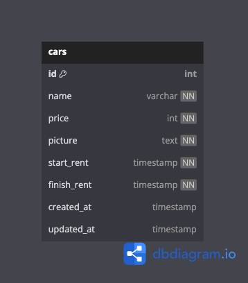

### SYNRGY 7 BINAR CHALLENGE 5 RESTFUL API FSW 2 HAFIIDH LUQMANUL HAKIM

### INSTRUCTION
1. Clone project into your local
2. Change directory to this project folder `cd 24001118-synrgy7-haf-bcr-ch5`
3. Use command `npm install`
4. Next step use command `npm run compile` to compile TypeScript into JavaScript
5. Make sure copy `.env.example` file to `.env` and fill up the correct value of your PostgreSQL connection!
6. Run command `npx knex migration:up` to create table via migration
7. Run command `npx knex seed:up` to fill up table with data seeder!
8. For final step run command `npm run start`

### ENDPOINT LIST

| API ENDPOINT    | METHOD   |     DESCRIPTION        |
|-----------------|----------|------------------------|
| `/api/cars`     |   `GET`  | Get All Data Cars      |
| `/api/cars/:id` |   `GET`  | Get By Id Data Cars    |
| `/api/cars/`    |  `POST`  | Post Data Cars         |
| `/api/cars/:id` |   `PUT`  | Update Data Cars By Id |
| `/api/cars/:id` | `DELETE` | Delete Data Cars By Id |

### EXAMPLE DATA
- **Show All Data Cars**
    - **Request** 
        - Endpoint : `/api/cars`
        - method : `GET`
    - **Response**
        - Json Response :
        ```json
        {
            "status": true,
            "message": "Success Get Cars!",
            "data": {
                "cars": [
                    {
                        "id": 1,
                        "name": "Toyota Masserati",
                        "price": 5000000,
                        "picture": "http://res.cloudinary.com/dfylrgzcu/image/upload/v1715696905/fsw/jielnfz6kciufqwz4gwx.jpg",
                        "start_rent": "2024-05-14T20:14:00.000Z",
                        "finish_rent": "2024-05-20T20:14:00.000Z",
                        "created_at": "2024-05-14T14:28:20.071Z",
                        "updated_at": "2024-05-14T14:28:20.071Z"
                    },
                    {
                        "id": 3,
                        "name": "Toyota Camrige",
                        "price": 5000000,
                        "picture": "http://res.cloudinary.com/dfylrgzcu/image/upload/v1715701372/fsw/z97s2bg6pvgd8fhmcmh6.jpg",
                        "start_rent": "2024-05-14T20:14:00.000Z",
                        "finish_rent": "2024-05-20T20:14:00.000Z",
                        "created_at": "2024-05-14T15:42:47.327Z",
                        "updated_at": "2024-05-14T15:42:47.327Z"
                    },
                    {
                        "id": 4,
                        "name": "Yamaha M1",
                        "price": 5000000,
                        "picture": "http://res.cloudinary.com/dfylrgzcu/image/upload/v1715701410/fsw/zeonz7gx6smdlksc31or.jpg",
                        "start_rent": "2024-05-14T20:14:00.000Z",
                        "finish_rent": "2024-05-20T20:14:00.000Z",
                        "created_at": "2024-05-14T15:43:26.920Z",
                        "updated_at": "2024-05-14T15:43:26.920Z"
                    }
                ]
            }
        }
        ```
        - Status code : `200`

- **Show Data Cars By Id**
    - **Request** 
        - Endpoint : `/api/cars/:id`
        - Parameter: `:id`
        - method : `GET`
    - **Response**
        - Json Response :
        ```json
        {
            "status": true,
            "message": "Succeess Get Data Car By Id!",
            "data": {
                "car": {
                    "id": 1,
                    "name": "Toyota Masserati",
                    "price": 5000000,
                    "picture": "http://res.cloudinary.com/dfylrgzcu/image/upload/v1715696905/fsw/jielnfz6kciufqwz4gwx.jpg",
                    "start_rent": "2024-05-14T20:14:00.000Z",
                    "finish_rent": "2024-05-20T20:14:00.000Z",
                    "created_at": "2024-05-14T14:28:20.071Z",
                    "updated_at": "2024-05-14T14:28:20.071Z"
                }
            }
        }
        ```
        - Status Code : `200`

- **Insert Data Cars**
    - **Request**
        - Endpoint : `/api/cars`
        - Body : `form-data`
        - Method : `POST`
        - Form Data :

        | Key         | Value                    |
        | ----------- | ------------------------ |
        | name        | Ferrari 458 Italy        |
        | price       | 300                      |
        | picture     | file: ferrari_italy.jpeg |
        | start_rent  | 2024-05-16 12:22:09      |
        | finish_rent | 2024-05-17 12:22:09      |
    - **Response**
        - Json Response :
        ```json
        {
            "status": true,
            "message": "Success Add Car!"
        }
        ```
        - Status Code : `201`

- **Update Data Cars**
    - **Request**
        - Endpoint : `/api/cars/:id`
        - Parameter : `:id`
        - Body : `form-data`
        - Method : `PUT`
        - Form Data :

        | Key         | Value                    |
        | ----------- | ------------------------ |
        | name        | Ferrari 458 Italy        |
        | price       | 300                      |
        | picture     | file: ferrari_italy.jpeg |
        | start_rent  | 2024-05-16 12:22:09      |
        | finish_rent | 2024-05-17 12:22:09      |
    - **Response**
        - Json Response :
        ```json
        {
            "status": true,
            "message": "Success Edit Car!"
        }
        ```
        - Status Code : `200`

- **Delete Data Cars**
    - **Request**
        - Endpoint : `/api/cars/:id`
        - Parameter : `:id`
        - Method : `DELETE`
    - **Response**
        - Json Response :
        ```json
        {
            "status": true,
            "message": "Success Delete Car!"
        }
        ```
        - Status Code : `200`

### ERD (Entity Relationship Diagram)
